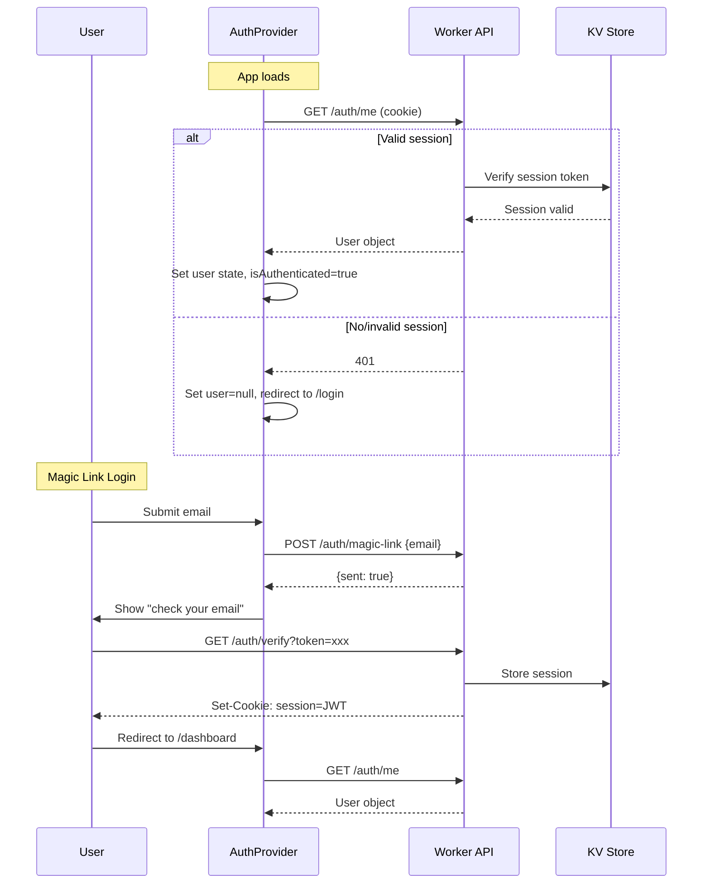

# Design Document: Production-Ready Portal

## Overview

This design transforms the University Grievance Portal frontend from a mock-data prototype into a production-ready application. The key changes are:

1. **Real authentication** — Replace the hardcoded `demoUser` in `lib/auth.tsx` with a proper `AuthProvider` that calls the Worker API (`/auth/me`, `/auth/magic-link`, `/auth/google`, `/auth/logout`, `/auth/refresh`).
2. **Client-side route protection** — Since Next.js is configured with `output: 'export'` (static site), all auth/permission checks happen client-side via a `RouteGuard` component.
3. **Live data via React Query** — Replace all imports from `lib/data.ts` with React Query hooks that call the Worker API.
4. **Role-derived navigation** — Remove the `Segmented` role toggle from the app shell; derive the active role from `user.roles`.
5. **Build correctness** — Remove `ignoreBuildErrors` and fix all TypeScript errors.
6. **Testing infrastructure** — Add Vitest + Testing Library for unit/integration tests and Playwright for E2E.

## Architecture

```mermaid
graph TD
    subgraph Browser
        A[Next.js Static App] --> B[AuthProvider]
        B --> C[RouteGuard]
        C --> D[Page Components]
        D --> E[React Query Hooks]
        E --> F[api() client]
    end

    F -->|fetch with credentials:include| G[Cloudflare Worker API]
    G --> H[D1 Database]
    G --> I[KV Session Store]
    G --> J[R2 Attachments]
```

### Authentication Flow



### Route Protection Strategy

Since the app is a static export, there is no server-side middleware. Protection is implemented as a client-side wrapper:

1. `AuthProvider` loads on mount, calls `/auth/me`.
2. While loading, all protected pages show a skeleton.
3. `RouteGuard` wraps page content and checks:
   - Is user authenticated? If not → redirect to `/login`.
   - Does user have required role/permission for this route? If not → redirect to `/dashboard` + toast.

### Role Hierarchy

```
portal_admin > institution_admin > student
```

The highest-privilege role in `user.roles[]` determines navigation. A `portal_admin` sees portal nav; an `institution_admin` sees admin nav; a `student` sees student nav.

## Components and Interfaces

### AuthProvider (`lib/auth.tsx`)

```typescript
interface AuthContextValue {
  user: SessionUser | null;
  isLoading: boolean;
  isAuthenticated: boolean;
  login: (email: string) => Promise<{ sent: boolean }>;
  loginWithGoogle: (payload: { email: string; name?: string; idToken?: string }) => Promise<void>;
  logout: () => Promise<void>;
  refresh: () => Promise<void>;
}
```

**Behavior:**
- On mount: calls `GET /auth/me`. If 401, sets `user = null`.
- `login(email)`: calls `POST /auth/magic-link`, returns result.
- `loginWithGoogle(payload)`: calls `POST /auth/google`, then `GET /auth/me`.
- `logout()`: calls `POST /auth/logout`, clears state, redirects to `/login`.
- `refresh()`: calls `POST /auth/refresh` to get a new token.

### RouteGuard (`components/shared/route-guard.tsx`)

```typescript
interface RouteGuardProps {
  children: React.ReactNode;
  requiredRole?: Role;
  requiredPermission?: Permission;
}
```

**Behavior:**
- Reads `useAuth()` context.
- If `isLoading` → render `<LoadingSkeleton />`.
- If `!isAuthenticated` → redirect to `/login`.
- If `requiredRole` and user doesn't have it → redirect to `/dashboard`, show toast.
- Otherwise → render `children`.

### React Query Hooks (`hooks/`)

Each hook wraps the `api()` function with React Query:

```typescript
// hooks/use-issues.ts
export function useIssues(params?: IssueFilters) {
  return useQuery({
    queryKey: ['issues', params],
    queryFn: () => api<Issue[]>('/issues?' + buildQuery(params)),
  });
}

export function useIssue(id: string) {
  return useQuery({
    queryKey: ['issues', id],
    queryFn: () => api<Issue>(`/issues/${id}`),
    enabled: !!id,
  });
}

export function useCreateIssue() {
  return useMutation({
    mutationFn: (data: CreateIssuePayload) => api<Issue>('/issues', { method: 'POST', body: JSON.stringify(data) }),
    onSuccess: () => queryClient.invalidateQueries({ queryKey: ['issues'] }),
  });
}
```

Similar patterns for:
- `useComments(issueId)`, `useCreateComment()`
- `useSolutions(issueId)`, `useCreateSolution()`
- `useTimeline(issueId)`
- `useNotifications()`
- `useAdminDashboard()`, `useAdminKanban()`, `useAdminAnalytics()`
- `usePortalDashboard()`, `usePortalUsers()`
- `useUpdateIssueStatus()`, `useAssignIssue()`

### AppShell Changes

- Remove `Segmented` role toggle from topbar.
- Remove `role` / `setRole` from `AppContext`.
- Derive navigation from `useAuth().user.roles`.
- Remove imports from `lib/data.ts` (NOTIFICATIONS, peopleById).
- Fetch notifications count via `useNotifications()`.

### Providers Tree

```
<ThemeProvider>
  <QueryClientProvider>
    <AuthProvider>        ← NEW: wraps everything
      <AppProvider>       ← SIMPLIFIED: no role state, no mock data
        <AppShell>
          <RouteGuard>    ← NEW: per-page or layout-level
            {children}
          </RouteGuard>
        </AppShell>
      </AppProvider>
    </AuthProvider>
  </QueryClientProvider>
</ThemeProvider>
```

### Utility: Role Resolution

```typescript
const ROLE_PRIORITY: Record<Role, number> = {
  portal_admin: 3,
  institution_admin: 2,
  student: 1,
};

export function getHighestRole(roles: Role[]): Role {
  return roles.reduce((highest, role) =>
    ROLE_PRIORITY[role] > ROLE_PRIORITY[highest] ? role : highest,
    roles[0]
  );
}
```

### Error Boundary (`components/shared/error-boundary.tsx`)

A React error boundary that catches render errors and displays a styled fallback with a "Go back" button.

### Loading Skeleton (`components/shared/loading-skeleton.tsx`)

Reusable skeleton components: `SkeletonLine`, `SkeletonCard`, `SkeletonTable`, `PageSkeleton`.

### 404 Page (`app/not-found.tsx`)

Custom Next.js not-found page with branding and a link back to dashboard.

## Data Models

### API Response Types (aligned with Worker API)

```typescript
// Types matching the Worker API responses
interface ApiUser {
  id: string;
  email: string;
  name: string;
  avatar_url: string | null;
  status: string;
  roles: Role[];
  permissions: Permission[];
}

interface ApiIssue {
  id: string;
  public_id: string;
  title: string;
  description: string;
  summary: string | null;
  category_id: string | null;
  department_id: string | null;
  author_id: string;
  assignee_id: string | null;
  status: string;
  urgency: string;
  priority_score: number;
  visibility: string;
  is_anonymous: boolean;
  is_locked: boolean;
  votes: number;
  comments_count: number;
  sla_due_at: string | null;
  first_response_at: string | null;
  resolved_at: string | null;
  created_at: string;
  updated_at: string;
  // Joined fields
  author?: ApiUser;
  assignee?: ApiUser;
  category?: { id: string; name: string; slug: string };
  department?: { id: string; name: string; slug: string };
  tags?: { id: string; name: string; slug: string }[];
}

interface ApiComment {
  id: string;
  issue_id: string;
  author_id: string;
  body: string;
  visibility: string;
  is_official: boolean;
  is_internal: boolean;
  is_pinned: boolean;
  created_at: string;
  updated_at: string;
  author?: ApiUser;
}

interface ApiSolution {
  id: string;
  issue_id: string;
  author_id: string;
  body: string;
  status: string;
  is_official: boolean;
  upvotes: number;
  helpful_count: number;
  created_at: string;
  updated_at: string;
  author?: ApiUser;
}

interface ApiNotification {
  id: string;
  user_id: string;
  type: string;
  title: string;
  body: string | null;
  issue_id: string | null;
  is_read: boolean;
  created_at: string;
}

interface ApiTimelineEvent {
  id: string;
  issue_id: string;
  actor_id: string;
  type: string;
  summary: string;
  metadata: Record<string, unknown> | null;
  created_at: string;
  actor?: ApiUser;
}

interface PaginatedResponse<T> {
  data: T[];
  meta: { page: number; limit: number; total: number };
}
```

### Route Permission Map

```typescript
const ROUTE_CONFIG: Record<string, { requiredRole?: Role; requiredPermission?: Permission }> = {
  '/admin':           { requiredRole: 'institution_admin' },
  '/admin/kanban':    { requiredRole: 'institution_admin' },
  '/admin/analytics': { requiredRole: 'institution_admin' },
  '/admin/settings':  { requiredRole: 'institution_admin' },
  '/portal':          { requiredRole: 'portal_admin' },
  '/portal/users':    { requiredRole: 'portal_admin' },
  '/portal/moderation': { requiredRole: 'portal_admin' },
  '/portal/audit':    { requiredRole: 'portal_admin' },
};
```

## Correctness Properties

*A property is a characteristic or behavior that should hold true across all valid executions of a system — essentially, a formal statement about what the system should do. Properties serve as the bridge between human-readable specifications and machine-verifiable correctness guarantees.*

### Property 1: Role hierarchy resolution is deterministic and correct

*For any* non-empty array of roles, `getHighestRole` SHALL return the role with the highest privilege level, and calling it multiple times with the same input SHALL always produce the same result.

**Validates: Requirements 4.1, 4.6**

### Property 2: Permission check consistency

*For any* `SessionUser` object and any `Permission` value, `hasPermission(user, perm)` SHALL return `true` if and only if `perm` is present in `user.permissions`, and `hasAnyPermission(user, perms)` SHALL return `true` if and only if at least one element of `perms` is present in `user.permissions`.

**Validates: Requirements 9.1**

### Property 3: Route guard authorization correctness

*For any* route path and user with a set of roles, the route guard SHALL grant access if and only if the user's highest-privilege role meets or exceeds the route's required role in the hierarchy.

**Validates: Requirements 5.2, 5.3**

### Property 4: API client error propagation

*For any* non-2xx HTTP response from the Worker API, the `api()` function SHALL throw an Error containing the error message from the response body.

**Validates: Requirements 6.4**

### Property 5: Navigation items match role

*For any* user with a single role, the navigation items returned by the nav-resolution function SHALL contain exactly the items defined for that role and no items from other roles.

**Validates: Requirements 4.3, 4.4, 4.5**

## Error Handling

| Scenario | Handling |
|----------|----------|
| `/auth/me` returns 401 on load | Clear state, redirect to `/login` |
| `/auth/magic-link` returns 403 (wrong domain) | Show inline error on login form |
| `/auth/verify` with invalid token | Show error toast, redirect to `/login` |
| Any API call returns 401 mid-session | Global React Query `onError` clears auth, redirects to `/login` |
| Any API call returns 5xx | Show error state with retry button on the page |
| Network failure (offline) | React Query retries 3 times, then shows error state |
| React component render error | Error boundary catches, shows fallback UI |
| 404 route | Next.js `not-found.tsx` renders custom 404 page |

### Global Error Handler (React Query)

```typescript
const queryClient = new QueryClient({
  defaultOptions: {
    queries: {
      retry: 3,
      staleTime: 30_000,
    },
    mutations: {
      onError: (error) => {
        if (error.message.includes('401') || error.message.includes('Authentication')) {
          // Trigger logout
        }
      },
    },
  },
});
```

## Testing Strategy

### Unit Tests (Vitest + @testing-library/react)

| Module | What to test |
|--------|-------------|
| `getHighestRole()` | Role hierarchy resolution for all combinations |
| `hasPermission()` / `hasAnyPermission()` | Permission checking logic |
| `api()` function | Error extraction, header setting, credentials |
| `AuthProvider` | State transitions: loading → authenticated, loading → unauthenticated, logout |
| `RouteGuard` | Redirect behavior for unauthenticated, unauthorized, and authorized users |
| Navigation resolver | Correct nav items per role |

### Property-Based Tests (Vitest + fast-check)

Property-based testing is appropriate here because the permission system, role hierarchy, and route guard logic are pure functions with clear input/output behavior and a large input space (many role/permission combinations).

- **Library**: `fast-check` (via `@fast-check/vitest` or direct integration)
- **Minimum iterations**: 100 per property
- **Tag format**: `Feature: production-ready-portal, Property N: <title>`

| Property | What it validates |
|----------|-------------------|
| Property 1: Role hierarchy | `getHighestRole` is deterministic and picks highest |
| Property 2: Permission checks | `hasPermission` / `hasAnyPermission` correctness |
| Property 3: Route guard auth | Access granted iff role meets requirement |
| Property 4: API error propagation | Non-2xx always throws with message |
| Property 5: Nav items match role | Correct items for each role |

### Integration Tests (Vitest + MSW for API mocking)

- Login flow (magic link + Google)
- Issue list fetching and display
- Issue creation form submission
- Voting on issues
- Status change via kanban drag

### End-to-End Tests (Playwright)

Critical path:
1. Visit `/` → redirected to `/login`
2. Login via magic link flow
3. View dashboard with real data
4. Navigate to issues list
5. Create a new issue
6. View issue detail with comments and timeline
7. Logout → redirected to `/login`

### Test File Structure

```
apps/web/
├── vitest.config.ts
├── src/__tests__/
│   ├── unit/
│   │   ├── get-highest-role.test.ts
│   │   ├── permissions.test.ts
│   │   ├── api-client.test.ts
│   │   └── nav-resolver.test.ts
│   ├── property/
│   │   ├── role-hierarchy.property.test.ts
│   │   ├── permissions.property.test.ts
│   │   ├── route-guard.property.test.ts
│   │   ├── api-errors.property.test.ts
│   │   └── nav-items.property.test.ts
│   └── integration/
│       ├── auth-provider.test.tsx
│       ├── route-guard.test.tsx
│       ├── issues-page.test.tsx
│       └── login-page.test.tsx
├── e2e/
│   ├── playwright.config.ts
│   └── tests/
│       ├── auth.spec.ts
│       ├── issues.spec.ts
│       └── dashboard.spec.ts
```
